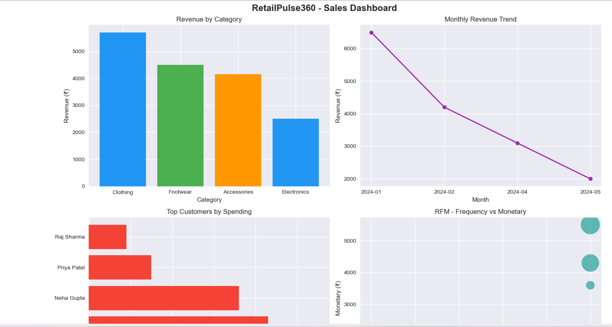
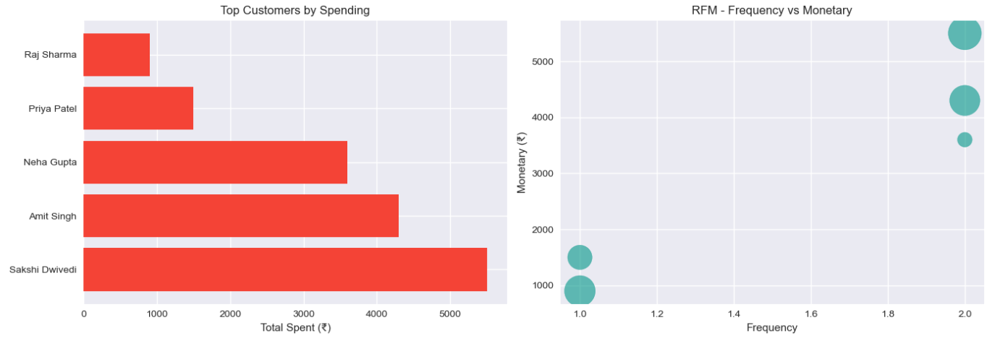

# RetailPulse360 
End-to-end Retail & E-commerce Analytics using Python, SQLite, Jupyter Notebook, and Power BI
# Project Overview
RetailPulse360 is a complete retail and e-commerce analytics project that simulates a real-world data pipeline - from raw sales data to interactive dashboards. It covers data generation, storage, SQL-based analysis, and business intelligence visualization.
# Features
SQLite Database - Structured storage for retail/e-commerce data.
Python & Jupyter Notebook - Data generation, cleaning, and exploration.
SQL Queries - Business insights like top products, sales trends, customer behavior.
Power BI Dashboards - Visual reports for decision-making.
End-to-end Pipeline - From raw data to final insights.
## Folder Structure

RetailPulse360/
├── sql/
├── docs/
├── .gitignore
├── LICENSE
└── README.md

## Technologies Used

| Tool | Purpose |
|------|---------|
| Python 3 | Data generation & processing |
| SQLite3 | Database storage |
| Jupyter Notebook | Analysis & exploration |
| Power BI | Dashboard & visualization |

## How to Use

1. Clone the repository
   git clone https://github.com/dwivedisakshi0507-nlp/RetailPulse360.git

2. Open Jupyter Notebook
   jupyter notebook

3. Explore SQL queries in the sql/ folder

## Contact

Sakshi Dwivedi
GitHub: @dwivedisakshi0507-nlp

# Dashboard Preview

If you found this project helpful, please give it a star!
